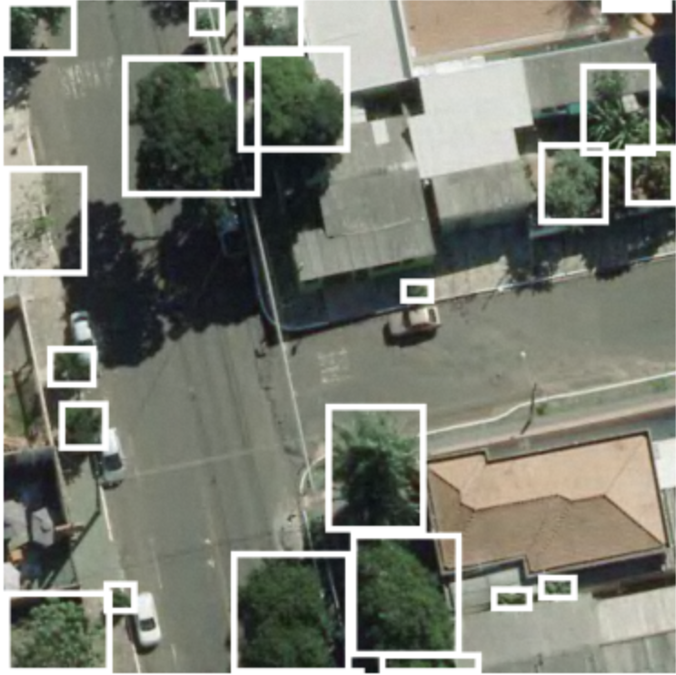
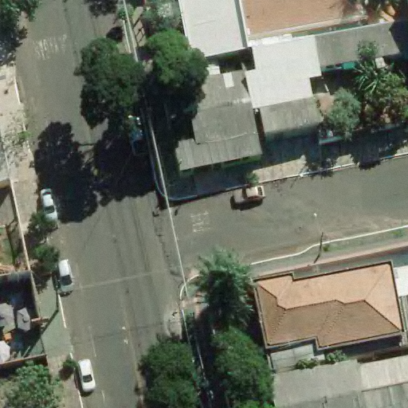
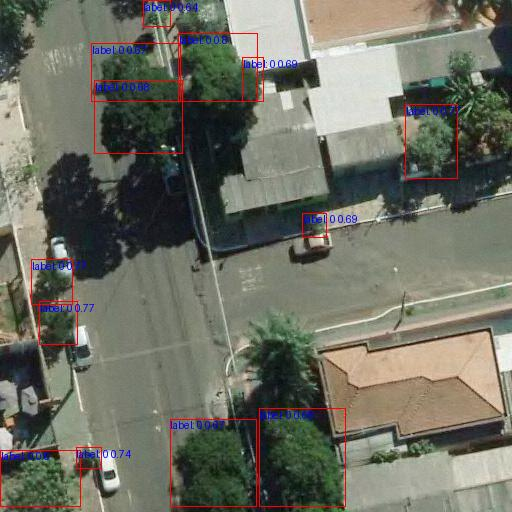

# Improving Urban Treetop Detection with RT-DETR: A Comparative Study with State-of-the-Art Deep Learning Methods

This repository explores the application of the RT-DETR method for detecting individual tree crowns in urban environments, based on the dataset provided by [Zamboni et al](https://github.com/pedrozamboni/individual_urban_tree_crown_detection). Two experiments were conducted: one using the original dataset and another incorporating data augmentation to enhance performance. RT-DETR, leveraging ResNet34 (VD) and ResNet50 Medium (VD) backbones, achieved a 2.6% improvement in AP50 compared to Zamboni’s best model (0.719 vs. 0.701). Even without augmentation, RT-DETR demonstrated competitive results (AP50 of 0.692), showcasing its robustness and efficiency for urban forest management in complex scenarios.


### RT-DETR Performance

| Backbone               | Input shape | Dataset       | DA | AP<sub>50</sub> |
|------------------------|-------------|---------------|----|-----------------|
| RT-DETR-DLA34         | 512         | UrbanTree     | N  | 0.645           |
| RT-DETR-ResNet18 (VD) | 512         | UrbanTree     | N  | 0.615           |
| RT-DETR-ResNet34 (VD) | 512         | UrbanTree     | N  | 0.637           |
| **RT-DETR-ResNet50 (VD)** | 512      | UrbanTree     | N  | **0.692**       |
| RT-DETR-ResNet50 Medium (VD) | 512   | UrbanTree     | N  | 0.683           |
| RT-DETR-RegNet        | 512         | UrbanTree     | N  | 0.657           |
| RT-DETR-ResNet-101 (VD) | 512       | UrbanTree     | N  | 0.658           |


| Backbone               | Input shape | Dataset       | DA | AP<sub>50</sub> |
|------------------------|-------------|---------------|----|-----------------|
| RT-DETR-DLA34         | 512         | UrbanTree     | Y  | 0.687           |
| RT-DETR-ResNet18 (VD) | 512         | UrbanTree     | Y  | 0.706           |
| **RT-DETR-ResNet34 (VD)** | 512      | UrbanTree     | Y  | **0.719**       |
| RT-DETR-ResNet50 (VD) | 512         | UrbanTree     | Y  | 0.712           |
| **RT-DETR-ResNet50 Medium (VD)** | 512 | UrbanTree   | Y  | **0.719**       |
| RT-DETR-RegNet        | 512         | UrbanTree     | Y  | 0.685           |
| RT-DETR-ResNet-101 (VD) | 512       | UrbanTree     | Y  | 0.705           |

*DA = data augmentation.*

## Individual Test Images

<div style="text-align: center; margin-bottom: 20px;">
    
    <p>Ground Truth</p>
</div>

<div style="text-align: center; margin-bottom: 20px;">
    
    <p>Original Image</p>
</div>

<div style="text-align: center; margin-bottom: 20px;">
    
    <p>Test Result</p>
</div>

### Quick start

```bash
pip install -r requirements.txt
```

### Training, Evaluation and Export
```bash
# training on single-gpu
export CUDA_VISIBLE_DEVICES=0
python tools/train.py -c configs/rtdetr/rtdetr_r50vd_6x_coco.yml

# train on multi-gpu
export CUDA_VISIBLE_DEVICES=0,1,2,3
torchrun --nproc_per_node=4 tools/train.py -c configs/rtdetr/rtdetr_r50vd_6x_coco.yml

# val on multi-gpu
export CUDA_VISIBLE_DEVICES=0,1,2,3
torchrun --nproc_per_node=4 tools/train.py -c configs/rtdetr/rtdetr_r50vd_6x_coco.yml -r path/to/checkpoint --test-only

# export
python tools/export_onnx.py -c configs/rtdetr/rtdetr_r18vd_6x_coco.yml -r path/to/checkpoint --check
```

### Dataset
#### The UrbanTree Dataset is in the 🚀 `dataset` 🚀 directory in this repository.
The structure below will be generated based on the dataset made available in this repository, when using google colab: [improving_urban_treetop_detection_with_RT-DETR.ipynb](https://github.com/wedrey/urban-treetop-detection-rt-detr/blob/main/improving_urban_treetop_detection_with_RT-DETR.ipynb).

  ```
  dataset/
  ├── annotations/  # annotation files
  ├── test/         # test images
  ├── train/        # train images
  └── val/          # validation images
  ```
